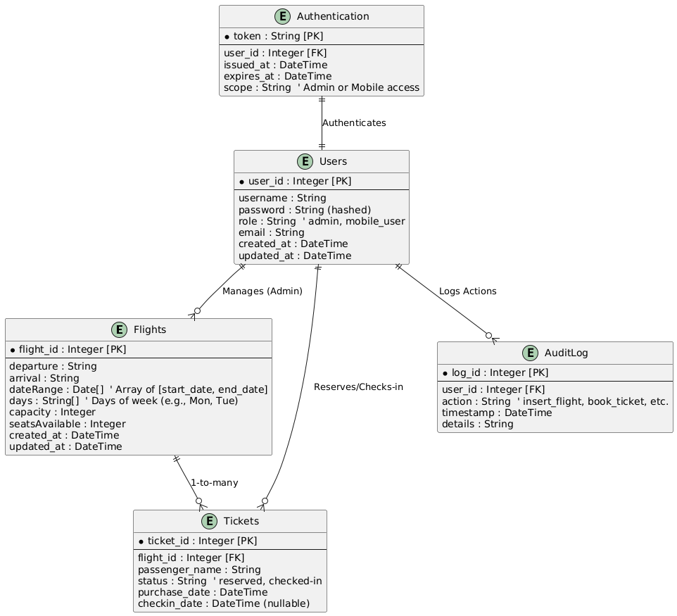

# Airline API Project

This is a RESTful API for managing airline operations such as flight creation, ticket booking, passenger check-ins, and reporting available flights. The API is built using Node.js and Express, and data is stored in MongoDB.

## **Project Links**
- **Source Code:** [Airline-API](https://github.com/Mertcanvuralll/Airline-API)
- **Live API (Render Deployment):** [Airline API](https://airline-api-tend.onrender.com/api/v1)
- **Demonstration Video:** [YouTube Video](https://www.youtube.com/watch?v=gaZjbdERzak)

---

## **Features**
1. **Admin Features:**
   - Insert new flights based on date range, repeating days, and capacity.
   - Generate reports for flights with a specific capacity.
2. **Mobile Features:**
   - Query available flights based on date range and route.
   - Book tickets for specific flights.
   - Perform check-in for passengers.
3. **Authentication:**
   - Admin users can log in and perform secured operations.
   - JWT-based authentication is used for secured API endpoints.

---

## **Authentication**
1. Admin Login:
   - **Endpoint:** `POST /auth/login`
   - **Sample Credentials:**
     - **Username:** `admin`
     - **Password:** `admin123`
   - Use these credentials to log in and generate a JWT token for admin operations.

---

## **Your Design**
### **System Design Overview**
The system is designed to be modular and scalable, with the following key components:
- **API Layer:**
  - RESTful endpoints for various operations.
  - Express.js as the framework for routing and middleware.
- **Database Layer:**
  - MongoDB for storing persistent data.
  - Collections: Flights, Tickets, and Users.
- **Authentication:**
  - JWT-based authentication to secure admin endpoints.
  - Bearer tokens for access control.
- **Documentation:**
  - Swagger UI for API documentation, accessible at `/api/v1/docs`.

## **Entity-Relationship (ER) Diagram**

Below is the ER diagram for the Airline API project:

---

### **Design Choices**
- **Pagination:** Offset-based paging for flight queries to handle large datasets efficiently.
- **Error Handling:** Centralized error responses for better debugging and user experience.
- **Swagger Integration:** Provides an interactive interface for testing the API.

---

## **Assumptions**
1. **Authentication:**
   - Only admin users can access `/admin` endpoints.
   - Admins must provide a valid JWT token for authentication.
2. **Date Validation:**
   - The `dateRange` parameter must include exactly two dates in the format `[startDate, endDate]`.
   - Dates are validated to ensure logical order (startDate ≤ endDate).
3. **Flight Capacity:**
   - Flights cannot be overbooked; tickets can only be booked if seats are available.
4. **Environment Variables:**
   - The project requires a `.env` file for sensitive data like `MONGO_URI` and `JWT_SECRET`.
5. **Default Values:**
   - If pagination parameters (`offset` and `limit`) are not provided, defaults of `0` and `10` are used.

---

## **Issues Encountered**
1. **CORS Errors:**
   - Issue: Swagger UI could not fetch API responses due to cross-origin restrictions.
   - Solution: Added CORS middleware to handle cross-origin requests.
2. **Date Range Validation in Swagger:**
   - Issue: Users could add more than two dates in `dateRange`.
   - Solution: Modified backend logic to enforce exactly two dates and added descriptive error messages in Swagger.
3. **Deployment on Render:**
   - Issue: `.env` file is not included in the deployment.
   - Solution: Added environment variables directly in Render's dashboard.
4. **Pagination Logic:**
   - Issue: Incorrect offset and limit handling in flight queries.
   - Solution: Fixed the logic to calculate and apply proper offsets for each request.
5. **Admin Authorization:**
   - Issue: Invalid tokens were incorrectly labeled as "Authorized" in Swagger.
   - Solution: Updated token validation logic and provided clear error messages.
